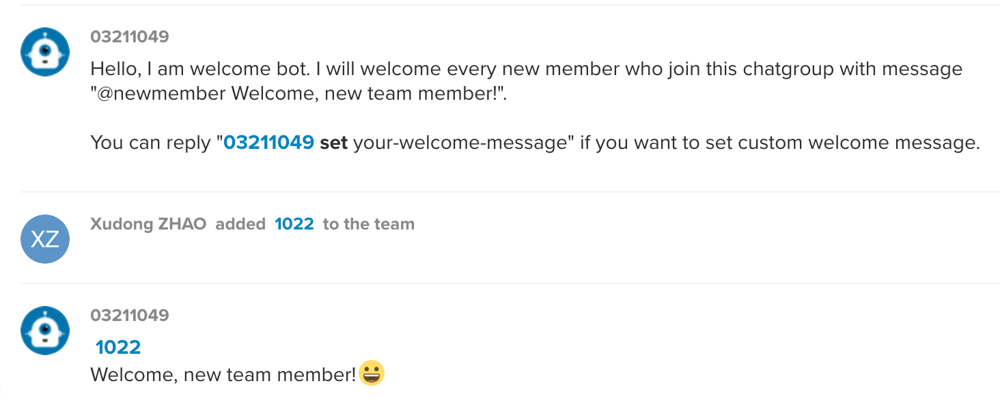

# ringcentral-welcome-bot-js

Glip chatbot to welcome new team member, created with [ringcentral-chatbot-factory](https://github.com/zxdong262/ringcentral-chatbot-factory) and [ringcentral-chatbot-js](https://github.com/ringcentral/ringcentral-chatbot-js).



## Prerequisites

- Nodejs 8.10+/npm, recommend using [nvm](https://github.com/creationix/nvm) to install nodejs/npm
- Yarn (`npm i -g yarn`)
- Create the bot App: Login to [developer.ringcentral.com](https://developer.ringcentral.com) and create an `public` `Server/Bot` app with permissions: `ReadContacts, ReadMessages, ReadPresence, Contacts, ReadAccounts, SMS, InternalMessages, ReadCallLog, ReadCallRecording, WebhookSubscriptions, Glip`

## Development & Quick start

```bash
# install dependencies
yarn

# run ngrok proxy
# since bot need https server,
# so we need a https proxy for ringcentral to visit our local server
yarn proxy
# will show:
# Forwarding https://xxxxx.ngrok.io -> localhost:3000

# create env file
cp .sample.env .env
# then edit .env, set proper setting,
# and goto your ringcentral app setting page, set OAuth Redirect URI to https://https://xxxxx.ngrok.io/bot/oauth

# create bot logic file
# edit src/bot.js to create your own bot logic
cp bot.js src/bot.js

# run local dev server
yarn start

```

## Test bot

- Goto your ringcentral app's bot section, click 'Add to glip'
- Login to [https://glip-app.devtest.ringcentral.com](https://glip-app.devtest.ringcentral.com), find the bot by searching its name. Talk to the bot.
- Edit config.py to change bot bahavior and test in [https://glip-app.devtest.ringcentral.com](https://glip-app.devtest.ringcentral.com)

## Building and Deploying to AWS Lambda

AWS Lambda with API Gateway and RDS would give us a flexible way to deploy the bot.

Get an AWS account, create `aws_access_key_id` and `aws_secret_access_key` and place them in `~/.aws/credentials`, like this:

```bash
[default]
aws_access_key_id = <your aws_access_key_id>
aws_secret_access_key = <your aws_secret_access_key>
```

For more information, refer to [https://docs.aws.amazon.com/general/latest/gr/aws-security-credentials.html](https://docs.aws.amazon.com/general/latest/gr/aws-security-credentials.html)

```bash
cp dist/serverless.sample.yml dist/serverless.yml
cp dist/.env.sample.yml dist/.env.yml
```

Edit `dist/serverless.yml` and `dist/.env.yml`, and make sure you set the proper name and required env.

Deploy to AWS Lambda with `yarn build && yarn deploy`

```bash
# build
yarn build

# Run this cmd to deploy to AWS Lambda, full build, may take more time
yarn deploy

## watch Lambda server log
yarn watch

```

Do not forget to set your RingCentral app's redirect URL to Lambda's API Gateway URL, `https://xxxx.execute-api.us-east-1.amazonaws.com/prod/bot/oauth` for bot app.

## License

MIT
  